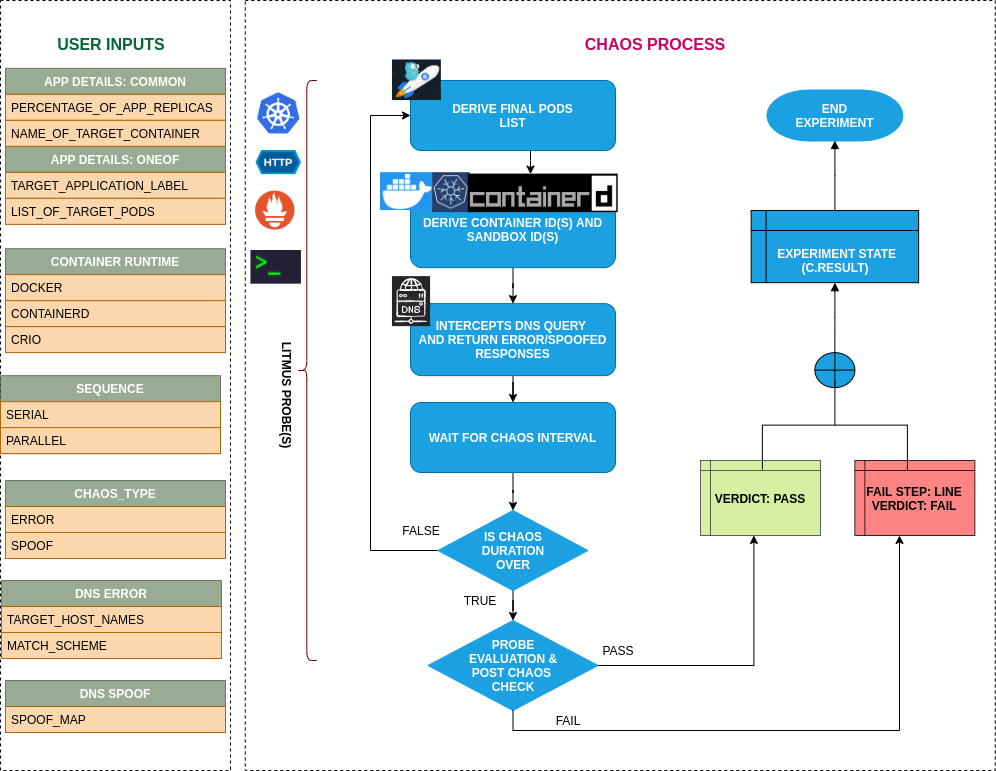

## Pod DNS Spoof

- Pod-dns-spoof injects chaos to spoof dns resolution in kubernetes pods.
- It causes dns resolution of target hostnames/domains to wrong IPs as specified by SPOOF_MAP in the engine config.

## Pod DNS Error

- Pod-dns-error injects chaos to disrupt dns resolution in kubernetes pods.
- It causes loss of access to services by blocking dns resolution of hostnames/domains

## Learn more

Check out the documentation
https://litmuschaos.github.io/litmus/experiments/categories/contents/
