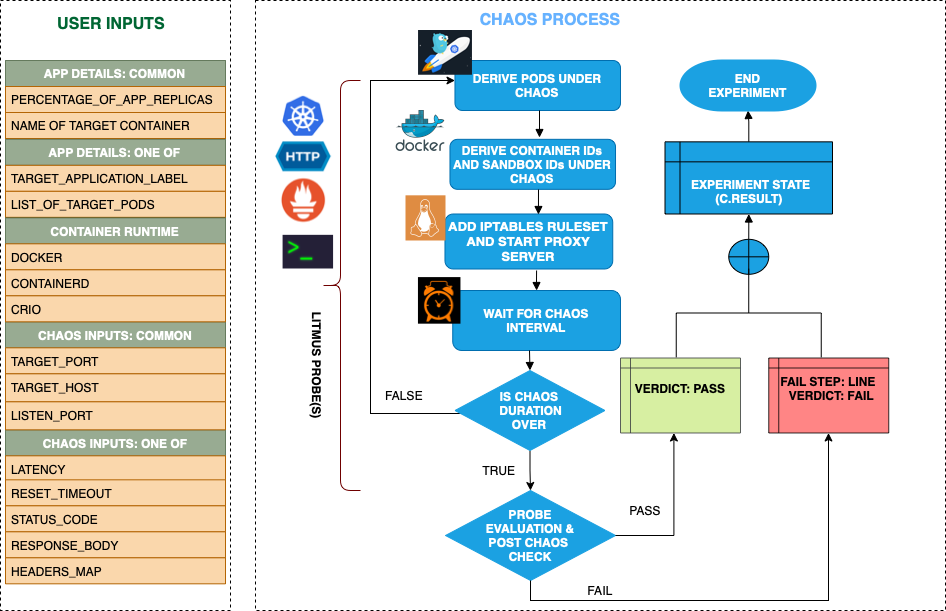

## Modify Header

- It injects http modify header on the service whose port is provided as TARGET_SERVICE_PORT by starting proxy server and then redirecting the traffic through the proxy server.
- It can cause modification of headers of requests and responses of the service. This can be used to test service resilience towards incorrect or incomplete headers.

## Modify Body

- It injects http modify body chaos on the service whose port is provided as TARGET_SERVICE_PORT by starting proxy server and then redirecting the traffic through the proxy server.
- Can be used to overwrite the http response body by providing the new body value as RESPONSE_BODY.
- It can test the application's resilience to error or incorrect http response body.

## Learn more

Check out the documentation
https://litmuschaos.github.io/litmus/experiments/categories/contents/
